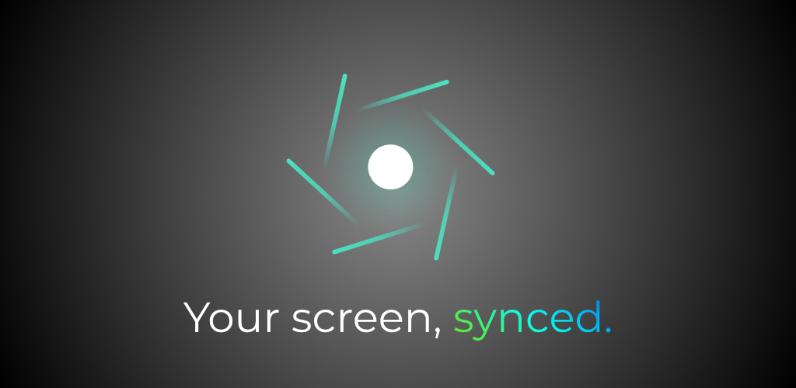
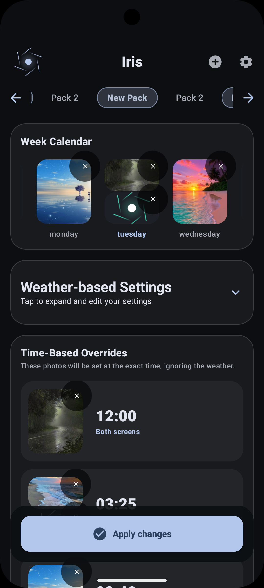
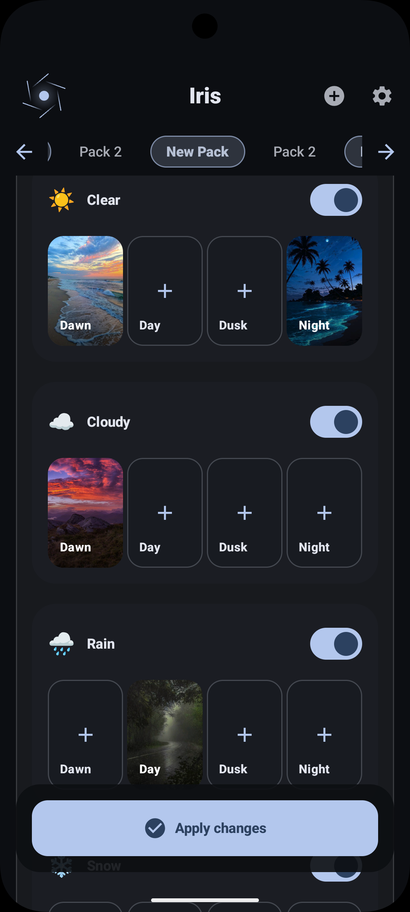
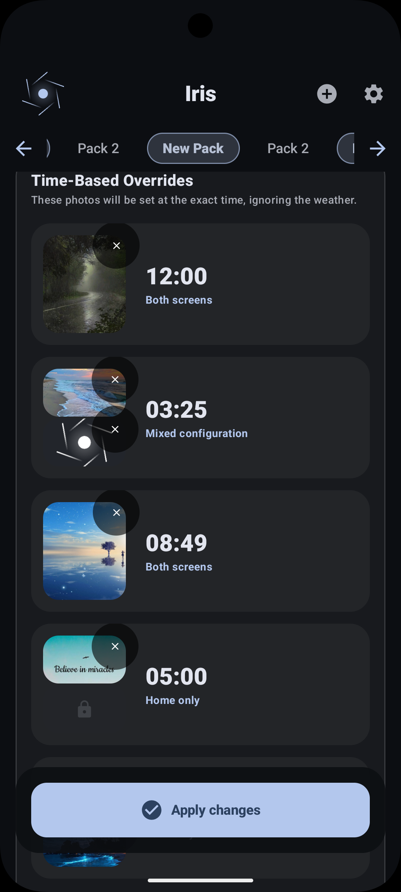

**Your wallpaper. Alive.** — *Tu fondo de pantalla. Vivo.*

Your home screen that changes with the weather, the hour, the day... or plays your favorite videos and GIFs.
*Tu pantalla que cambia con el clima, la hora, el día... o reproduce tus videos y GIFs favoritos.*

**[📲 Download on Google Play](https://play.google.com/store/apps/details?id=com.andyl.iris)** · **[Descargar en Google Play](https://play.google.com/store/apps/details?id=com.andyl.iris)**

---

## 📸 See it in action / Miralo en acción

<table>
  <tr>
    <td align="center"></td>
    <td align="center"></td>
    <td align="center"></td>
  </tr>
</table>

---

## English

### What is IrisWallpaper?

IrisWallpaper turns your phone into a living canvas. Instead of a static image, your wallpaper **reacts to the real world**: sunny when the sun is out, moody when it rains, cozy at dawn, epic at night. Or just play your own **videos and GIFs** as a true animated background — no loop hacks, no video-to-live converters.

### ✨ Feature Highlights

**🎬 True Video & GIF Wallpapers**
- Play any local video as your wallpaper: MP4, MOV, MKV, WEBM, AVI, WMV, FLV, MPEG, TS, OGV, 3GP and [more](#-supported-formats)
- Full support for animated **GIFs and animated WEBPs** — picked straight from your gallery or files
- Smooth native rendering with automatic looping, zero watermarks

**🌦️ Weather-Aware Backgrounds**
- 6 weather moods: ☀️ Clear · ☁️ Cloudy · 🌧️ Rain · ❄️ Snow · 🌫️ Fog · ⛈️ Storm
- Your wallpaper matches the sky outside, automatically

**⏰ Time-Based Themes**
- Daily cycle: 🌅 Dawn → ☀️ Day → 🌇 Dusk → 🌙 Night
- Fixed-time rules: schedule a specific wallpaper for any `HH:mm` moment
- Weekly calendar: a different vibe for every day of the week

**🌡️ Temperature Rules**
- Freezing · Cold · Cool · Warm · Hot — your screen feels the seasons too

**📍 Location Magic**
- Create places with custom radius zones — arrive home, at work, or anywhere, and your whole pack switches automatically
- Inverted zones supported (trigger when you *leave* an area)

**🖼️ Endless Content**
- 30+ curated packs: Cinematic Landscapes, Neon Symphony, Anime Vibe, Cyber Samurai, Selección Argentina, Deep Space, Sakura Dream... with seasonal editions
- Built-in search across high-quality photo providers
- Use your own gallery: photos *and* videos, including random-album mode

**🎨 Make It Yours**
- Crop, fit or stretch modes + manual crop control
- Apply to home screen, lock screen, or both
- Optional text overlay on your wallpaper
- Full history with one-tap undo

**🔋 Battery Friendly**
- Smart battery saver mode with a configurable threshold — pause fancy updates when you're running low
- Efficient live wallpaper engine that pauses when your screen is off

### 🎥 Supported Formats

| Type | Formats |
|---|---|
| **Video containers** | MP4 · M4V · MOV · MKV · WEBM · AVI · WMV · FLV · F4V · MPG/MPEG · M2V · TS · M2TS · MTS · OGV · 3GP · 3G2 · ASF · DIVX · VOB · RM/RMVB |
| **Animated images** | GIF · Animated WEBP |
| **Static images** | JPG · PNG · WEBP · HEIF |

> Playback of exotic containers (AVI, WMV...) depends on your device's codecs. If a format isn't playable, Iris gracefully falls back instead of breaking.

### 🔒 Privacy First

Location is only used to fetch weather and evaluate your geofence rules — never sold, never shared. Everything else lives on your device.

### 📲 Download

****

Requires Android 8.0+

---

## 🇦🇷 Español

### ¿Qué es IrisWallpaper?

IrisWallpaper convierte tu teléfono en un lienzo vivo. En vez de una imagen estática, tu fondo de pantalla **reacciona al mundo real**: soleado cuando sale el sol, melancólico cuando llueve, acogedor al amanecer, épico de noche. O simplemente reproducí tus propios **videos y GIFs** como fondo animado de verdad — sin trucos ni convertidores raros.

### ✨ Funcionalidades destacadas

**🎬 Fondos de video y GIF reales**
- Reproducí cualquier video local como fondo: MP4, MOV, MKV, WEBM, AVI, WMV, FLV, MPEG, TS, OGV, 3GP y [más](#-formatos-soportados)
- Soporte completo para **GIFs y WEBPs animados** — elegilos directo de tu galería o archivos
- Render nativo fluido con loop automático, cero marcas de agua

**🌦️ Fondos que siguen el clima**
- 6 ambientes climáticos: ☀️ Despejado · ☁️ Nublado · 🌧️ Lluvia · ❄️ Nieve · 🌫️ Niebla · ⛈️ Tormenta
- Tu fondo acompaña el cielo de afuera, automáticamente

**⏰ Temas según la hora**
- Ciclo diario: 🌅 Amanecer → ☀️ Día → 🌇 Atardecer → 🌙 Noche
- Reglas de hora fija: programá un fondo específico para cualquier momento `HH:mm`
- Calendario semanal: una vibra distinta para cada día

**🌡️ Reglas por temperatura**
- Helada · Frío · Templado · Cálido · Calor — tu pantalla también siente las estaciones

**📍 Magia por ubicación**
- Creá lugares con zonas de radio personalizado — llegás a casa, al trabajo o donde sea y tu pack entero cambia solo
- Zonas invertidas soportadas (se activan cuando *salís* de un área)

**🖼️ Contenido infinito**
- Más de 30 packs curados: Cinematic Landscapes, Neon Symphony, Anime Vibe, Cyber Samurai, Selección Argentina, Deep Space, Sakura Dream... con ediciones de temporada
- Buscador integrado con proveedores de fotos de alta calidad
- Usá tu propia galería: fotos *y* videos, incluido modo álbum aleatorio

**🎨 Hacelo tuyo**
- Modos recortar, ajustar o estirar + recorte manual preciso
- Aplicá a pantalla de inicio, pantalla de bloqueo, o ambas
- Overlay de texto opcional sobre tu fondo
- Historial completo con deshacer de un toque

**🔋 Cuida la batería**
- Modo ahorro inteligente con umbral configurable — pausá las actualizaciones cuando estás bajo de batería
- Motor eficiente que se pausa cuando la pantalla está apagada

### 🎥 Formatos soportados

| Tipo | Formatos |
|---|---|
| **Contenedores de video** | MP4 · M4V · MOV · MKV · WEBM · AVI · WMV · FLV · F4V · MPG/MPEG · M2V · TS · M2TS · MTS · OGV · 3GP · 3G2 · ASF · DIVX · VOB · RM/RMVB |
| **Imágenes animadas** | GIF · WEBP animado |
| **Imágenes estáticas** | JPG · PNG · WEBP · HEIF |

> La reproducción de contenedores exóticos (AVI, WMV...) depende de los codecs de tu dispositivo. Si un formato no es reproducible, Iris hace fallback elegante en vez de romperse.

### 🔒 Privacidad primero

La ubicación se usa únicamente para obtener el clima y evaluar tus reglas de geocercas — nunca se vende ni se comparte. Todo lo demás vive en tu dispositivo.

### 📲 Descargalo

****

Requiere Android 8.0+

---

**Hecho con ❤️ y Jetpack Compose** · Kotlin · Material 3 · Media3/MediaPlayer · WorkManager · Koin

*[IrisWallpaper](https://play.google.com/store/apps/details?id=com.andyl.iris) — because a wallpaper should never be boring.*
*[IrisWallpaper](https://play.google.com/store/apps/details?id=com.andyl.iris) — porque un fondo de pantalla nunca debería ser aburrido.*

